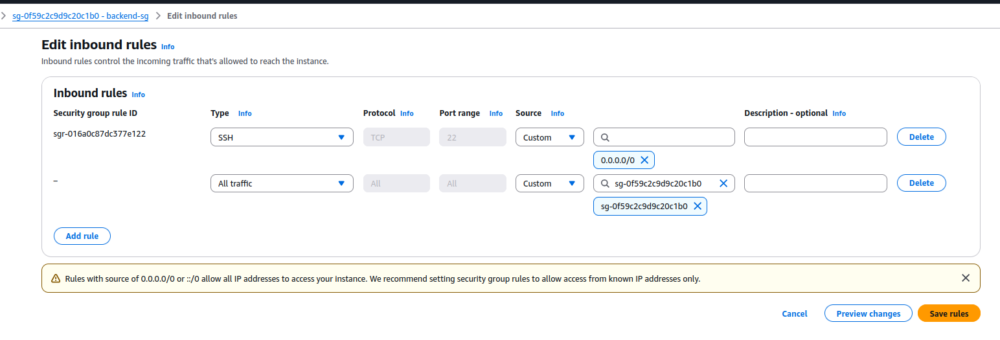

# Key Pair and Security Group Setup

1. Create Key Pair for Beanstalk Instance Login

   Name: bean-key
 
   
2. Creat Security Group for Back End Services (Elastic Cache, RDS & Active MQ)
	
   Name: backend-sg
   
   Description: Security Group for Backend Services (Elastic Cache, RDS & Active MQ)
   
   Inbound Rule - Allow SSH
   
  3. Create the security group first and then edit inboud rule to add **the security group id** itself for internal traffic communicagtion.
   
   