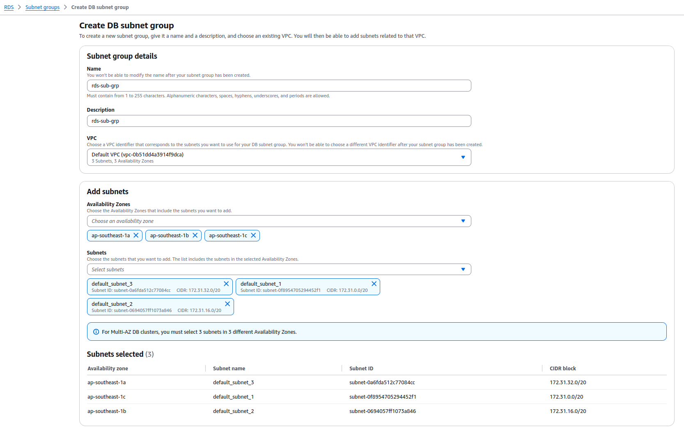
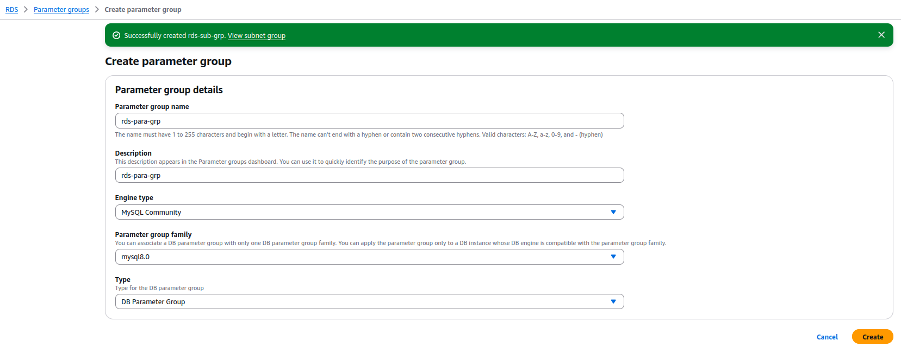
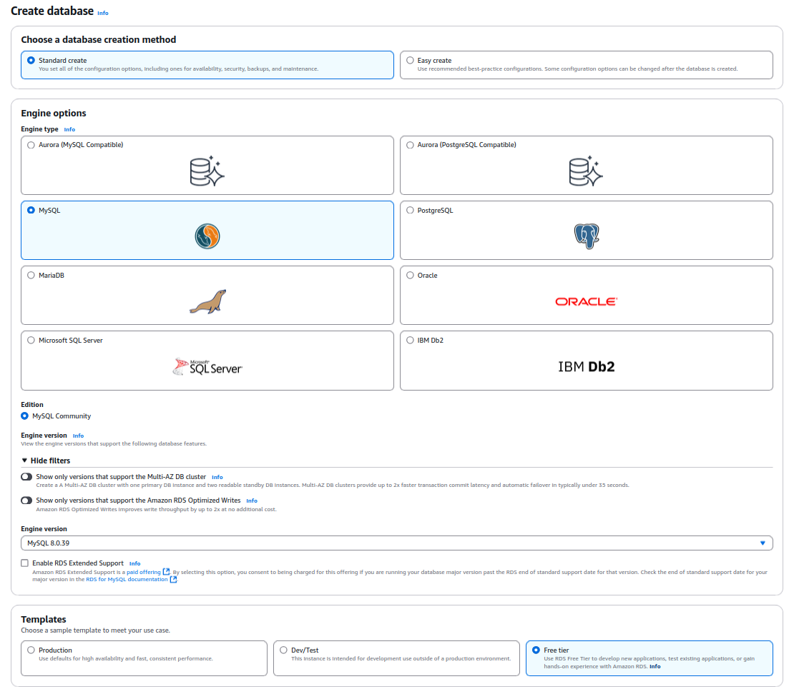
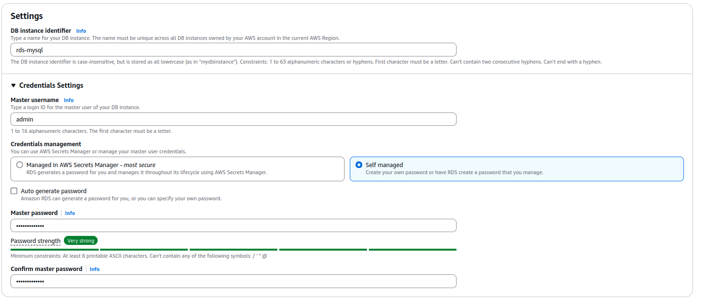
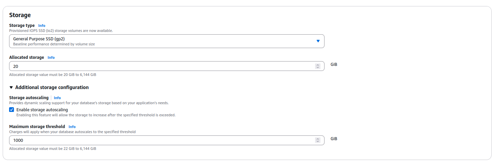
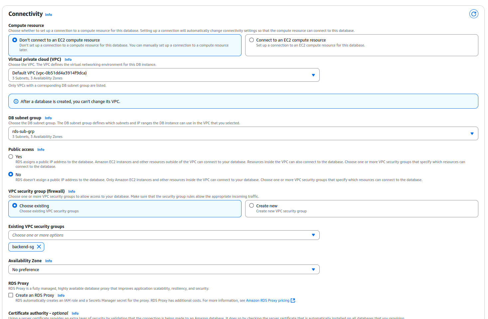
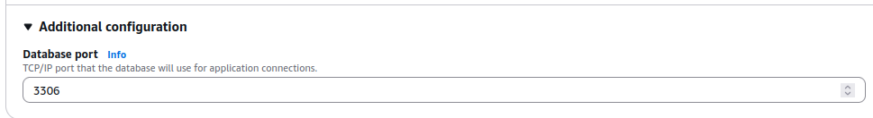
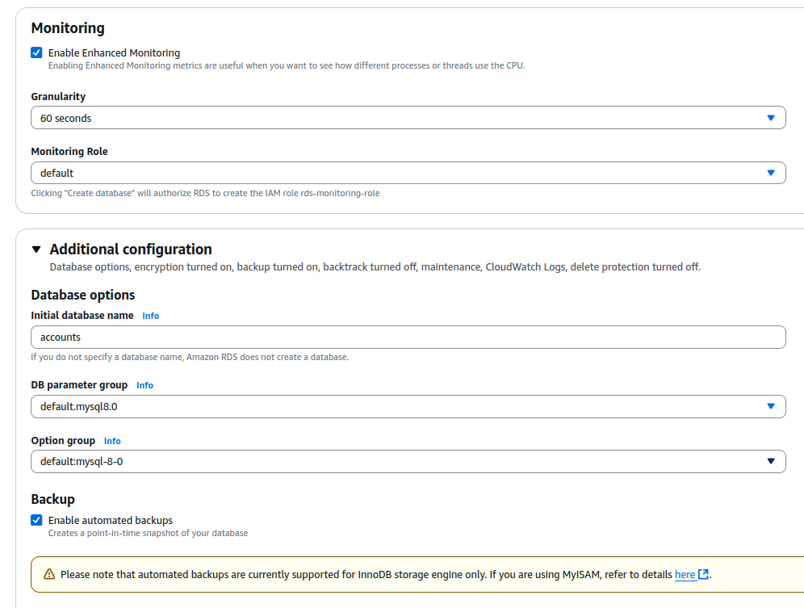

# Resource Creation

## Create RDS (MySQL)

1. Create DB Subnet Groups
   
   Name: **rds-sub-grp**
   
   VPC: Default VPC
   
   
   
2. Create Parameter Groups

   Name: rds-para-group

   
   
3. Create Database

   We will use **Standard Create** and choose **MySQL**

   
   
   Input **Master username** and **Master password** for future use.
   
   
   
   GP SSD (GP2) is used.
   
   
   In DB Subnet Group, please select the subnet group **rds-sub-grp** created in step 1
   
   Security Group: backend-sg
   
   
   
   Please note the Database Port **3306**, which is used in the source code for connection with the database.
   
   
   
   Tick **Enable Enhanced Monitoring**
   
   For **Initial Datase Name**, we input **accounts** because in [Database Initialization](4_database_initialization.md), we will setup the required data in that database for the web app.
   
   After all, review and created RDS.
   
   