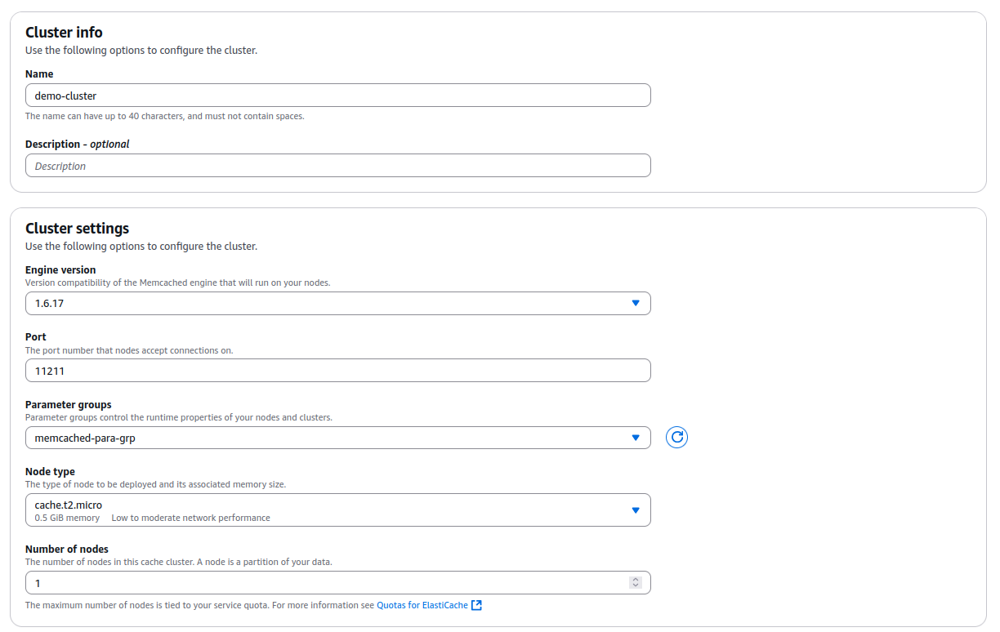

# ElasticCache Setup

1. Create Subnet Group
	The Same procedure with RDS Setup, we will create subnet Group first and then parameter group to be used in ElasticCache setup.
	
	Name: **memcached-sub-grp**
	
	VPC: Default VPC
	
	
2. Create Parameter Group

	Name: memcached-para-grp  

	
3. Create Memcached

	Choose "Design your own cahce" for our own configuration.

	
	
	Cluster Name: demo-cluster
	
	Default Port: **11211** is used for Memcached.
	
	Please select the created **memcached-para-grp**
	
	
	
	Please select the created **memcached-sub-grp**
	
	
	
	Please review and create ElasticCache.
	
	
	

