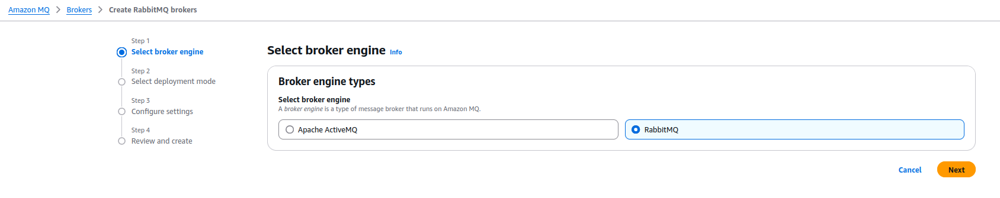
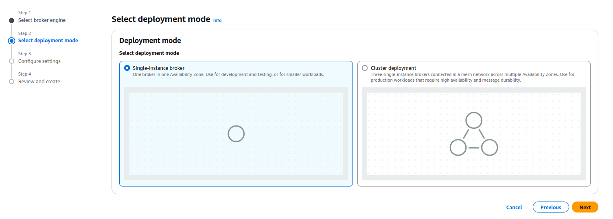
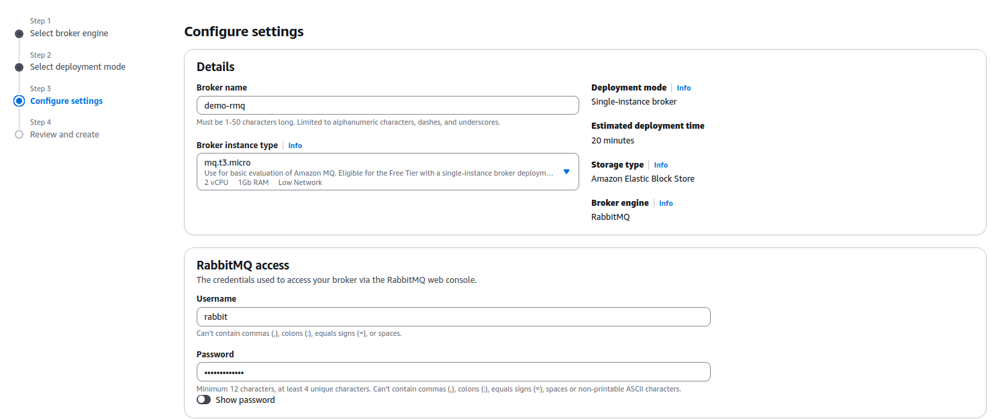
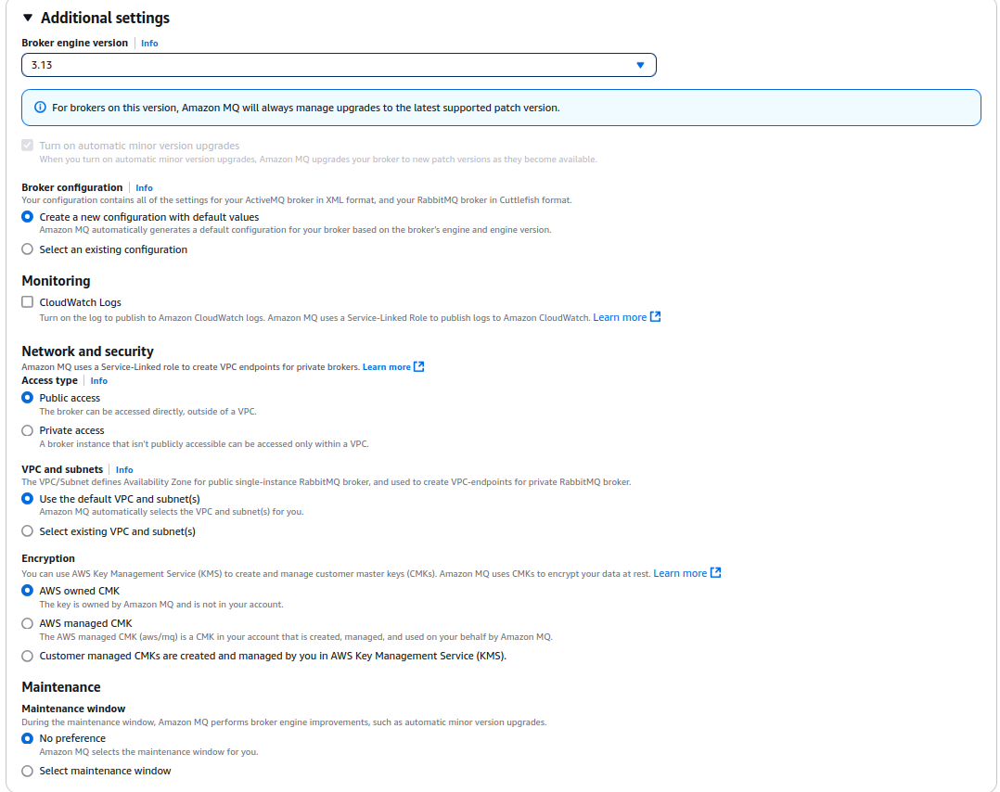

# AMAZON MQ SETUP

Go to Amazon MQ in AWS and Create RabbitMQ Brokers

Select **RabbitMQ**

Single Instance Broker is used here for demo purpose.

Broker Name: **demo-rmq**

Broker Instance Type: rmq.t3.micro

Define Username and Password for RabbitMQ Access

Broker Engine Version: 3.13

Access Type: Public Access

Default VPC is used

Then review and create.

