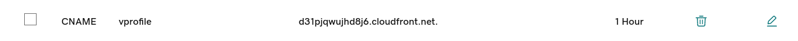

# DNS and CDN

## DNS

 1. Point Beanstalk URL to vprofile.minpyae.xyz in GoDaddy DNS 

	As the certifacte is created for *.minpyae.xyz*, the page will now show secured.

	GoDaddy> DNS> Add New Records > 

	Type: CNAME

	Name: vprofile

	Endpoint: Beanstalk URL

2. Load the Webapp again and it will now show secure.

	
	

## Verification
1. Login with WebApp username and password. 
2. The WebApp is working.
	
3. Click on **RabbitMq**
	
4. Click on **All Users** and then click on one of the users.

	The data are loaded from RDS
	
5. Click again on the same user again.
6. 
	The user is loaded from Memcached
	
	
## CDN

### CloudFront

- Content Delivery Network by Edge Locations
- Cache our website or app to the Edge Locations
- For the global audience

1. Remove the CNAME record from GoDaddy.

   The new CNAME record will be pointing to CloudFront.
   
2. Create a CloudFront Distrubution

   CloudFront > Create a CloudFront Distribution
   
   Origin Domain > Select the ELB created by the Beanstalk

   Protocol: Match viewer
   
   
   
   
   Allow HTTPS Methods : All
   
   
   
   Cache key and origin requests>Legacy cache settings

	Headers: All

	Query Strings: All

	Cookies: All
	
	
	
	Web Application Firewall : Disabled (Not free)

    Use all edge locations (best performance) (30 minutes free)

    Alternate domain name (CNAME): vprofile.minpyae.xyz
    
    
    
    Select the certificate created for **.minpyae.xyz*
    
    Security Policy: TLSv1

	And then create distribution
	
	
	After creation, copy URL of CloudFront and create CNAME record for that URL in GoDaddy.
	
	
	GoDaddy > 

	Type: CNAME

	Name:vprofile

	Value: URL of CloudFront (Remove https://)
	
	
	
	After deploying, wait for a few minutes
	
	
	## Verification
	
	Clear the cache of the browser and use the inspect tool to check where the traffic is coming from.

	https://vprofile.minpyae.xyz
	
	
	
	The traffic is coming from the nearest location of the user.
	
	Now the project is finall finished.