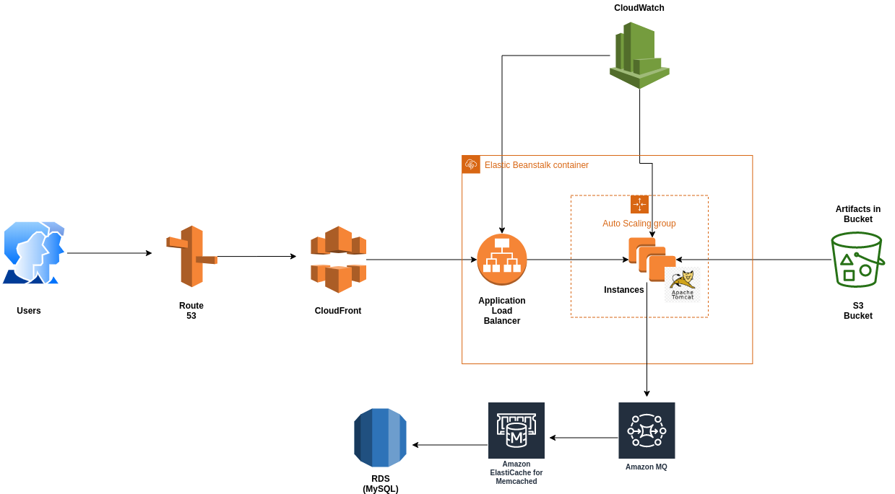

# Deploying a Multi-Tier Web Application Stack on AWS Elastic Beanstalk

## Web Application Architecture

The application stack includes:

1. Nginx Load Balancer
2. Tomcat App Server
3. Rabbit MQ
4. Memcached
5. MySQL Database
6. GoDaddy DNS Service

## Web Application Architecture on AWS

The application stack on AWS includes:

1. Route 53
2. Amazon CloudFront
3. Amazon CloudWatch
4. S3 Bucket
5. Elastic Beanstalk
6. Active MQ
7. Elastic Cache
8. Amazon RDS (MySQL)

## Comparison of AWS Services with Traditional Application Stack Components

| **AWS Services**    | **Traditional App Stack**                  |
|----------------------|-------------------------------------------|
| **Elastic Beanstalk with ELB** | Nginx Load Balancer / Manual ELB Setup |
| **Auto Scaling**     | Manual Scaling or None                   |
| **EFS / S3**         | NFS / EFS / S3                           |
| **RDS**              | MySQL on VM / EC2 Instance               |
| **Elastic Cache**    | Memcached on VM / EC2 Instance           |
| **Active MQ**        | RabbitMQ on VM / EC2 Instance            |
| **Route 53**         | Local DNS (e.g., BIND) / GoDaddy         |
| **CloudFront**       | No CDN / Multi-DC Setup Worldwide        |

## Web Application Source Code

https://github.com/hkhcoder/vprofile-project/tree/awsrefactor

## Flow of Execution

1. [Key Pair and Security Group Setup](1_KeyPair_and_Security_Group_Setup.md)
2. [RDS Setup](2_RDS_Setup.md)
3. [Memcached Setup](3_Elastic_Cache_Setup.md)
4. [Rabbit MQ Setup](4_Active_MQ_Setup.md)
5. [Database Initialization](5_database_initialization.md)
6. [Elastic Beanstalk Setup](6_bean_stalk_configuration.md)
7. [Application Deployment](7_application_deployment.md)
8. [CDN and DNS Configuration](8_dns_and_cdn.md)

